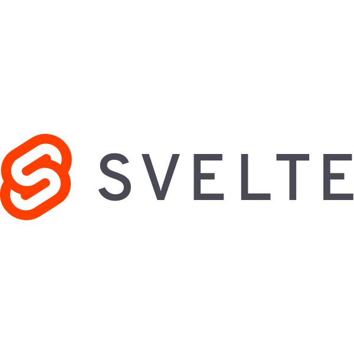

# DeComm - Coding4Integrity Pretoria Hackathon
## Team Lovelace 

> [!NOTE]
> We were building on the work handed to us by Corrupt Combat Coders. The winners of the previous Coding4Integrity hackathon. The link to their repo can be found [here](https://github.com/KnowledgeFound/Coding4Integrity-DeComm-Hackathon).

> [!IMPORTANT]
> Please visit their repo for more information on how to set the environment up after cloning our repository.

---

## Features Added!

- Register + Login
> We added authentication and security to access the application. We have also added input verification for the email and password.
- Theming 
> We added a theme toggle button for a light mode and dark mode. We also added a colour scheme (Green) to the application.
- Personal Dashboard on the landing page
> We have added a few things to the landing page. Namely:
> - Wallet Balance
> 
>   - You are now able to view your Knowledge Token balance.
> 
> - KT transfer
>
>   - You can now transfer Knowledge tokens to other valid Accounts. Users also have to input their account password for authentication and security purposes. 
>
> - KT Market value overview
> 
>   - There is a line graph now indicating the value of the Knowledge Tokens over the last 30 days. It is mocked right now.

- Personal Transactions
 
>   - There is now also a tab for you to see the history of your personal transactions over the last 30 days, which includes items you have bought and Knowledge Tokens you have received and sent.

- Wallet

>   - We have implemented unique Wallet ID generation upon successful registration for every user.
>   - We have added inter-wallet transactions (Sending and receiving Knowledge Tokens between valid accounts).
>   - Real-time tracking of wallet balances.

- Business Dashboard

> - There is a now a bar graph indicating your sales for the past 12 months.
> - There is a card indicating the number of NFTs you have sold over the last 30 days.
> - There is also a card indicating the revenue generated by NFT sales over the last 30 days.
> - Lastly, there is a transactions tab that indicates your business transactions for the last 30 days.

- Product Manager

> Add Products and View products have been implemented by Corrupt Combat Coders previously to us. We just placed them in their own tabs.

- Checkout

> The implementation has not been changed from the Corrupt Combat Coders implementation, We just added authentication to the checkout button for security reasons. The user now has to input their account password to checkout any products and NFTs they have placed.

---

> [!NOTE]
> Here is a link to our [Design Docs](https://github.com/theaman249/Coding4Integrity-DeComm-Hackathon/tree/develop/DesignDocs).

---

## Group Members

  

#### Agape Mamphasa

#### Role(s): Backend Engineer, Integration Engineer

#### BSc(Hons) Computer Science Student at The University Of Pretoria

#### [LinkedIn](https://www.linkedin.com/in/agape-mamphasa-92022a2a9/).

#### [GitHub](https://github.com/theaman249)

 
 
 
 

  

#### Amanda Khuzwayo

#### Role(s): Backend Engineer, Integration Engineer

#### BSc(Hons) Computer Science Student at The University Of Pretoria

#### [LinkedIn](https://www.linkedin.com/in/amanda-khuzwayo-894130135/).

#### [GitHub](https://github.com/Amanda9805).

 
 
 
 

  

#### Mbofho Mamatsharaga

#### Role(s): Frontend Engineer, Integration Engineer

#### 3rd Year Computer Science Student at The University Of Pretoria

#### [LinkedIn](https://www.linkedin.com/in/mbofho-mamatsharaga-54992823b/). 

#### [GitHub](https://github.com/TheStoryOfChampion).

 
 
 
 

  

#### Kea Motapo

#### Role(s): Frontend Engineer, Integration Engineer

#### 3rd Year Information Knowledge Systems student at the University Of Pretoria

#### [LinkedIn](https://www.linkedin.com/in/mbofho-mamatsharaga-54992823b/).
#### [GitHub](https://github.com/keamothapo).

 
 
 
 

---

## Tech Stack

|  |  |  |  |
| --- | --- | --- | --- |